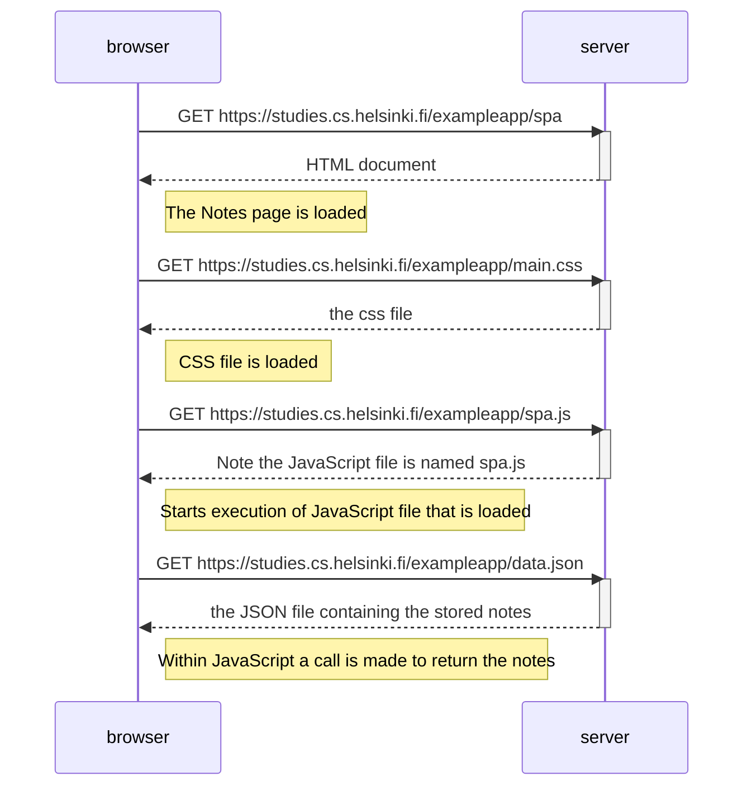

```mermaid
sequenceDiagram
    participant browser
    participant server

    browser->>server: GET https://studies.cs.helsinki.fi/exampleapp/spa
    activate server
    server-->>browser: HTML document
    deactivate server
    Note right of browser: The Notes page is loaded

    browser->>server: GET https://studies.cs.helsinki.fi/exampleapp/main.css
    activate server
    server-->>browser: the css file
    deactivate server
    Note right of browser: CSS file is loaded

    browser->>server: GET https://studies.cs.helsinki.fi/exampleapp/spa.js
    activate server
    server-->>browser: Note the JavaScript file is named spa.js
    deactivate server
    Note right of browser: Starts execution of JavaScript file that is loaded

    browser->>server: GET https://studies.cs.helsinki.fi/exampleapp/data.json
    activate server
    server-->>browser: the JSON file containing the stored notes
    deactivate server
    Note right of browser: Within JavaScript a call is made to return the notes

```
