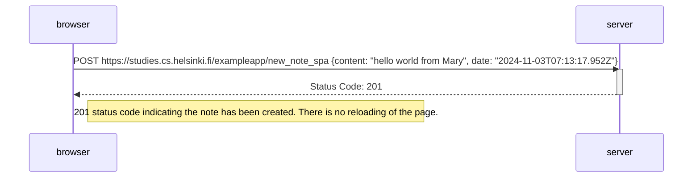

```mermaid
sequenceDiagram
    participant browser
    participant server

    browser->>server: POST https://studies.cs.helsinki.fi/exampleapp/new_note_spa {content: "hello world from Mary", date: "2024-11-03T07:13:17.952Z"}
    activate server
    server-->>browser: Status Code: 201
    deactivate server
    Note right of browser: 201 status code indicating the note has been created. There is no reloading of the page.

```
